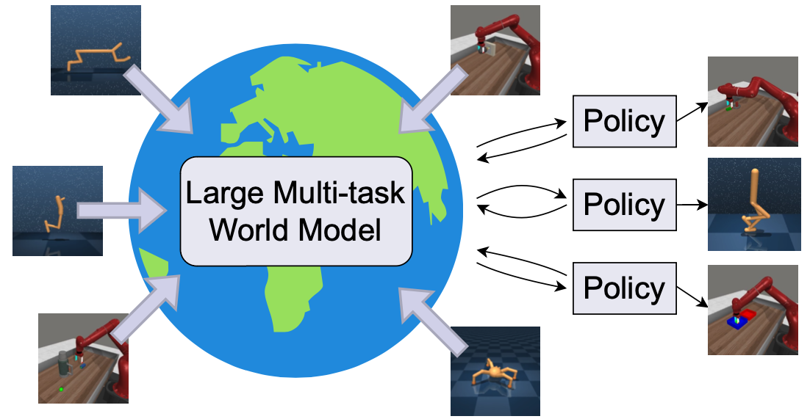

# PWM: Policy Learning with Large World Models

[Ignat Georgiev](https://www.imgeorgiev.com/), [Varun Giridhar](https://www.linkedin.com/in/varun-giridhar-463947146/), [Nicklas Hansen](https://www.nicklashansen.com/), [Animesh Garg](https://animesh.garg.tech/)

[Project website](http://imgeorgiev.com/pwm)  [Paper](https://arxiv.org/abs/2407.02466)  [Models & Datasets](https://huggingface.co/imgeorgiev/pwm)

This repository is a soft fork of [FoRL](https://github.com/pairlab/FoRL).

## Overview



Instead of building world models into algorithms, we propose using large-scale multi-task world models as
differentiable simulators for policy learning. When well-regularized, these models enable efficient policy
learning with first-order gradient optimization. This allows PWM to learn to solve 80 tasks in < 10 minutes
each without the need for expensive online planning.


## Installation

Tested only on Ubuntu 22.04. Requires Python, conda and an Nvidia GPU with >24GB VRAM.

```bash
git clone --recursive git@github.com:imgeorgiev/PWM.git
cd PWM
conda env create -f environment.yaml
conda activate pwm
ln -s $CONDA_PREFIX/lib $CONDA_PREFIX/lib64  # hack to get CUDA to work inside conda
pip install -e .
pip install -e external/tdmpc2
```


## Single environment tasks

The first option for running PWM is on complex single-tasks with up to 152 action dimensions in the Dflex simulator. These runs used pre-trained world models which can be [downloaded from hugging face](https://huggingface.co/imgeorgiev/pwm/tree/main/dflex/pretrained).

```
cd scripts
conda activate pwm
python train_dflex.py env=dflex_ant alg=pwm general.checkpoint=path/to/model
```

> Due to the nature of GPU acceleration, it is impossible to currently impossible to guarantee deterministic experiments. You can make them "less random" by using `seeding(seed, True)` but that slows down GPUs.

### Single environment with pretraining

Instead of loading a pre-trained world model, you pretrain one yourself using the [data](https://huggingface.co/imgeorgiev/pwm/tree/main/dflex/data):

```
cd scripts
conda activate pwm
python train_dflex.py env=dflex_ant alg=pwm general.pretrain=path/to/model pretrain_steps=XX
```

To recreate results from the original paper:

| Task | Pretrain gradient steps |
| -- | -- |
| Hopper | 50_000 |
| Ant | 100_000 |
| Anymal | 100_000 |
| Humanoid | 200_000 | 
| SNU Humanoid | 200_000 |


## Multitask setting

### Training large world model

We evaluate on the MT30 and MT80 task settings proposed by [TDMPC2](https://www.tdmpc2.com/).

1. Download the data for each task following the [TDMPC2 instructions](https://www.tdmpc2.com/dataset).
2. Train a world model from the TDMPC2 repository using the settings below. Note that `horizon=16` and `rho=0.99` are crucial. Note that training takes ~2 weeks on an RTX 3900. Alternatively, you can also use some of the pre-trained [multi-task world models we provide](https://huggingface.co/imgeorgiev/pwm/tree/main/multitask).
```
cd external/tdmpc2/tdmpc2
python -u train.py task=mt30 model_size=48 horizon=16 batch_size=1024 rho=0.99 mpc=false disable_wandb=False data_dir=path/to/data
```

where `path/to/data` is the full TDMPC2 dataset for either MT30 or MT80.


### Evaluate multi-task

Train a policy for a specific task using the pre-trained world model

```
cd scripts
python train_multitask.py -cn config_mt30 alg=pwm_48M task=pendulum-swingup general.data_dir=path/to/data general.checkpoint=path/to/model
```

- where `path/to/data` is the full TDMPC2 dataset for either MT30 or MT80.
- where `path/to/model` is the pre-trained world model as provided [here](https://huggingface.co/imgeorgiev/pwm/tree/main/multitask).

We also provide scripts which launch slurm tasks across all tasks. `scripts/mt30.bash` and `scripts/mt80.bash`

### Configs
```
cfg
├── alg
│   ├── pwm_19M.yaml - different sized PWM models which the main models that should be used. Paired with train_multitask.py
│   ├── pwm_317M.yaml - to be used with train_multitask.py
│   ├── pwm_48M.yaml 
│   ├── pwm_5M.yaml
│   ├── pwm.yaml - redunant but provided for reproducability; to be run with train_dflex.py
│   └── shac.yaml - works only with train_dflex.py
├── config_mt30.yaml - to be used with train_multitask.py
├── config_mt80.yaml - to be used with train_multitask.py
├── config.yaml  - to be used with train_dflex.py
└── env - dflex env config files
    ├── dflex_ant.yaml
    ├── dflex_anymal.yaml
    ├── dflex_cartpole.yaml
    ├── dflex_doublependulum.yaml
    ├── dflex_hopper.yaml
    ├── dflex_humanoid.yaml
    └── dflex_snu_humanoid.yaml
```

## Citation


```
@misc{georgiev2024pwm,
    title={PWM: Policy Learning with Large World Models},
    author={Ignat Georgiev, Varun Giridha, Nicklas Hansen, and Animesh Garg},
    eprint={2407.02466},
    archivePrefix={arXiv},
    primaryClass={cs.LG},
    year={2024}
}
```

